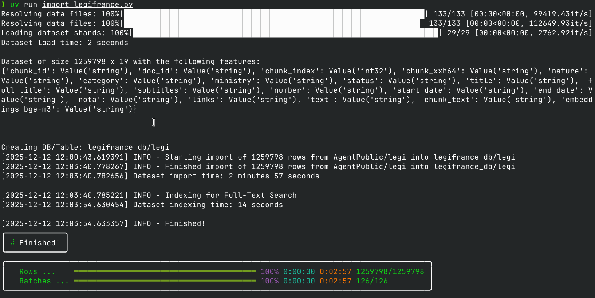
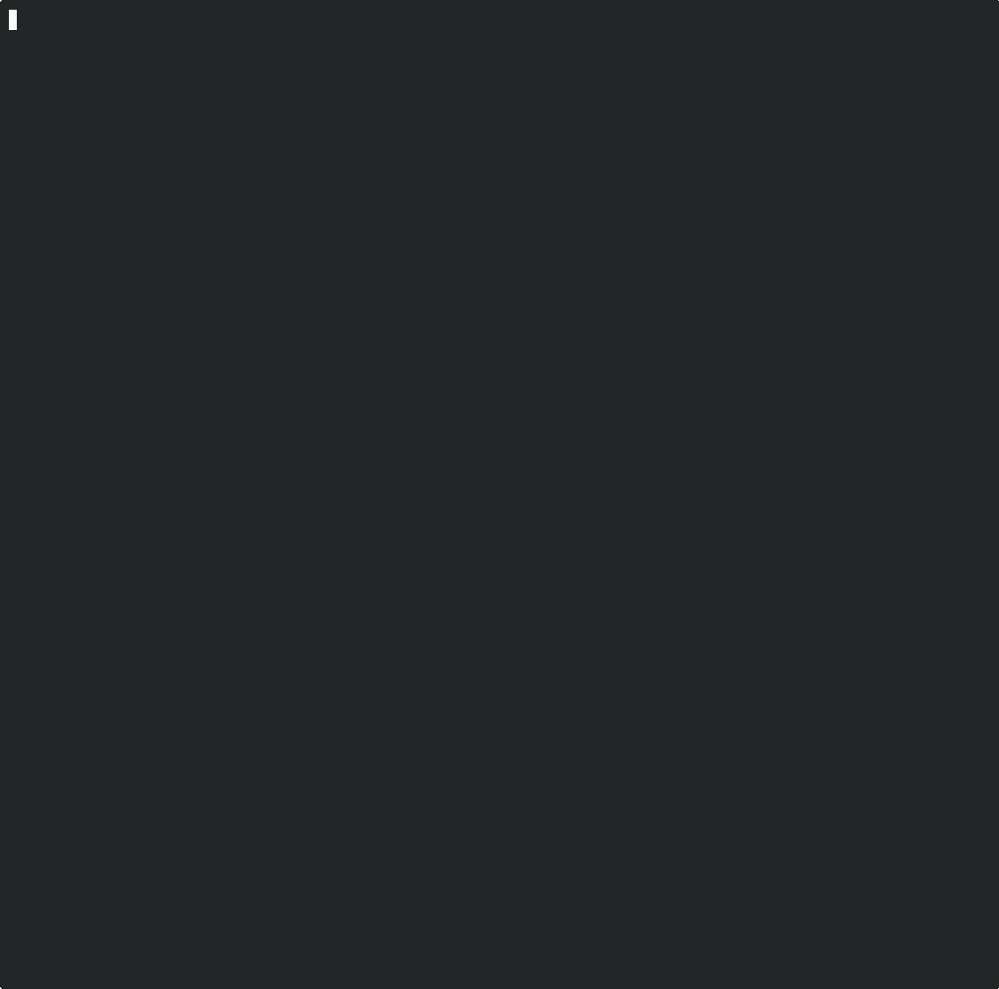
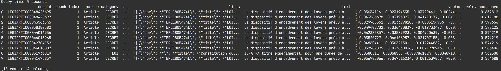

# Legifrance at home

Ceci est un projet pour accéder à l'ensemble des textes consolidés de la législation française et y effectuer des recherches textuelles, sémantiques et hybrides plus avancées que via la recherche intégrée au site web.

## Source des données

Les données proviennent du dataset https://huggingface.co/datasets/AgentPublic/legi
et sont mises à jour une fois par semaine.

Les données brutes proviennent de https://echanges.dila.gouv.fr/OPENDATA/LEGI/
et sont transformées par l'ETL https://github.com/etalab-ia/mediatech

## Utilisation

Le code requiert l'installation de `git` et `uv` ainsi qu'un lecteur de fichier `.csv` pour l'exploitation des résultats de recherche, par exemple LibreOffice ou OpenOffice pour des solutions open-source.

Tout d'abord, pour copier le code et installer des dépendances dans un environment virtuel

```
git clone https://github.com/mratsim/legifrance-at-home
cd legifrance-at-home

uv sync
```

Puis importer la base de donnée Légifrance. L'import nécessite de télécharger 7GiB de données puis les intègre a une base de donnée locale.

```
uv run import_legifrance.py
```



Ensuite une recherche peut être effectuée avec les paraètres suivants:
- `-q`: la recherche à effectuer
- `-n`: Le nombre de résultats

```
uv run search_legifrance.py -q "encadrement des loyers" -n 30
```

Les résultats seront affichés en tronqué dans le terminal et disponible
dans le dossier `queries`




## Réglages avancés

La recherche peut être accélérés par l'utilisation de carte graphique.
Il faut alors changer `DEVICE = "cuda"` pour les GPUs Nvidia ou `DEVICE = "mps"` pour MacOS (non-testé). (voir la documentation PyTorch https://docs.pytorch.org/docs/stable/tensor_attributes.html#torch.device).

L'import utilise les embeddings pré-vectorisés via [`BAAI/bge-m3`](https://huggingface.co/BAAI/bge-m3). Il est possible de choisir un nouvel embedding model lors de l'import pour améliorer la recherche sémantique.

La recherche utilise le reranker [`jinaai/jina-reranker-v2-base-multilingual`](https://huggingface.co/jinaai/jina-reranker-v2-base-multilingual) par défaut, qui est multilingue et rapide même sur CPU grâce à FlashAttention. Les rerankers disponibles sont listés sur https://lancedb.com/docs/integrations/reranking/, les rerankers sans clé d'API/inscription/paiement sont:
- CrossEncoderReranker, Liste non-exhaustive https://www.sbert.net/docs/cross_encoder/pretrained_models.html#community-models
- AnswerdotaiRerankers, https://github.com/AnswerDotAI/rerankers

## License

Licensed and distributed under

- Apache License, Version 2.0, ([LICENSE](./LICENSE) or http://www.apache.org/licenses/LICENSE-2.0)

This file may not be copied, modified, or distributed except according to those terms.